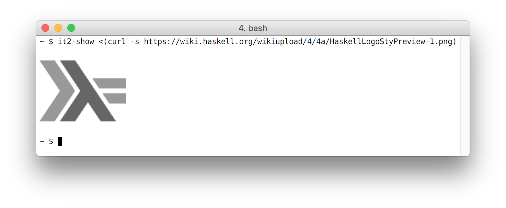

# iterm-show

`iterm-show` is a Haskell library for displaying inline documents in some
terminals, including iTerm and hterm.

# it2-show

`it2-show` is a simple command line tool for doing the same.

